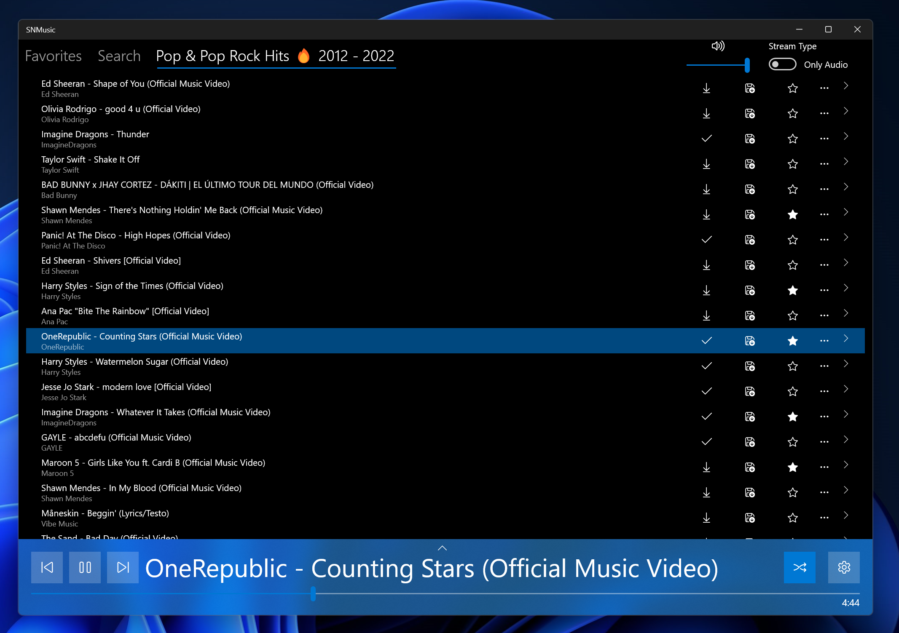

# SNMusic Music Player 
[END OF LIFETIME SINCE 2020]

SNMusic is a free Music Player app that can play Youtube Music Playlists, download and convert music.

The Project has reached its end of lifetime and will not recieve any updates or fixes.

The Project has reached its end of lifetime and will not recieve any updates or fixes.

## Technologies used

 - ### Microsoft XAML UI
 - ### C# 
 - ### .Net standard 2.0
 - ### Universal Windows Platform
 - ### Windows App SDK

## Features

- ### 🎉 Listen to any Youtube Music Playlists 
- ### 🧭 Download single songs or whole Playlists 
- ### 👌 Intuitive minimal UI 
- ### 💻 Create your own Playlists
- ### 🪄 Convert and Transcode Music 
- ### 👓 Search bar
- ### 🧬 Shuffle/RepeatOne/RepeatMany modes 

## Contributing
The project is not maintained anymore. Feel free to fork this project.

## License
[MIT](https://choosealicense.com/licenses/mit/)